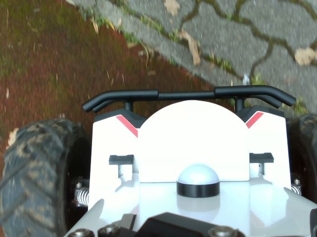
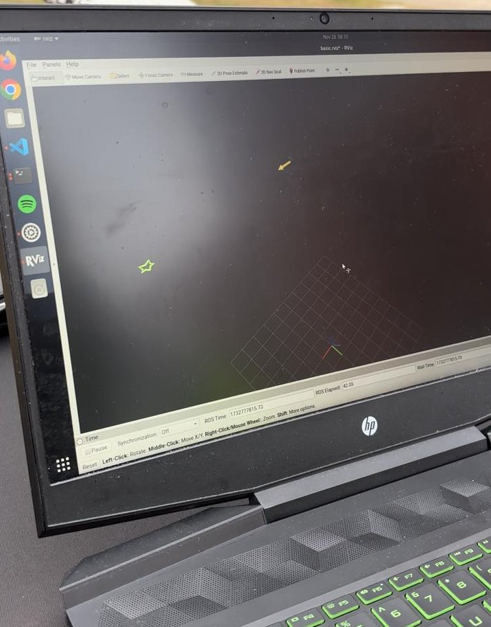
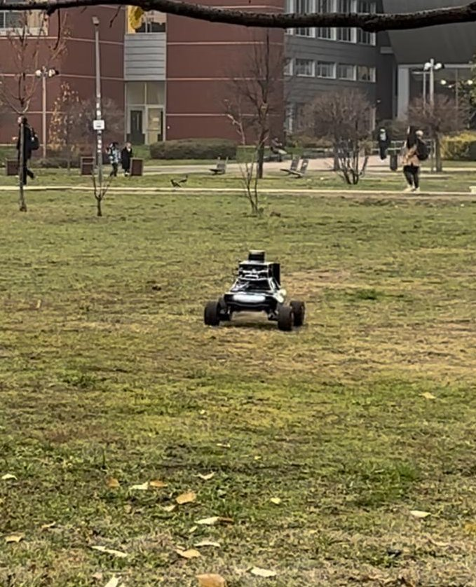

# GPS Waypoint Navigation Project  

This repository contains the main codebase deployed on the AgileX Scout Mini robot for the ELTE AUS/IFRoS lab in 2024.  

The objective of this project is to enable the robot to autonomously navigate to a series of GPS-defined waypoints in an outdoor environment. At each waypoint, the robot captures an image of the surroundings. The system integrates GPS and IMU data for navigation and provides real-time visualization in RViz.

Created by:  
**Liviu Florescu**

**Lisa Paul Magoti**

**Selin Yavuz**

---

## Project Team & Responsibilities  

| **Name**             | **Responsibilities**               |  
|-----------------------|-------------------------------------|  
| **Liviu Florescu**       | GPS navigation, IMU integration, and image capture |  
| **Lisa Paul Magoti**       | Controller, image handling |  
| **Selin Yavuz**       | ROS topics and system architecture, debugging, documentation |  

---

## Architecture  

### Project Overview  
The navigation system is designed to take GPS coordinates as inputs, convert them to a local coordinate frame, and navigate the robot to these points while adjusting its heading using IMU data. At each waypoint, an image of the surroundings is captured and stored for later use.  

### Components Diagram  
Here’s a high-level overview of the architecture and components involved:  

**System Architecture**

- **GPS Navigation**  
  The robot converts GPS waypoints to a local frame using a transformation pipeline. It continuously monitors its position relative to the target waypoint.  

- **IMU Data Integration**  
  IMU data is used for heading correction and navigation. Calibration offsets are accounted for to ensure reliable performance.  

- **Image Capture**  
  At each waypoint, the robot triggers its onboard camera to capture and save an image.  

- **Visualization**  
  RViz is used for real-time monitoring of the robot’s path, waypoints, and navigation progress.  

---

## Setup  

### Prerequisites  
Ensure you have ROS installed and configured on the robot.  

1. **Clone the Repository**  
   ```bash  
   git clone https://github.com/IFRoS-ELTE/navigators.git

    ```
3. **Build the Workspace**  
    ```bash  
    catkin_make  
    ```

4. **Connect CANBUS**  
    ```bash  
    rosrun scout_bringup setup_can2usb.bash
    ```

5. **Run the Launch File**  
    ```bash  
    roslaunch scout_bringup scout_minimal.launch
    ```

6. **Start GPS and Magnetometer**  
    ```bash  
    roslaunch xsens_mti_driver xsens.launch  

    ```
7. **Start Camera**  
    ```bash  
    roslaunch realsense2_camera rs_camera.launch

    ```
---
## Running the Code 

"basic.py" has the overall code of the project. With this script, we are navigating between two GPS waypoints in an outdoor setting, and capture an image with the camera. A visualization of the Rviz can be found below.

## Visuals from the robot





# Future Improvements

Below are some of the potential improvements and features that could be added to the project in the future:

| **To-Do**                               | **Description**                                                                                  | **Priority**   |
|-----------------------------------------|--------------------------------------------------------------------------------------------------|----------------|
| **Dynamic Path Planning**               | Improve path planning to adapt dynamically to changes in the environment (e.g., moving obstacles). | Medium         |
| **Obstacle Detection**                  | Implement obstacle detection to enable the robot to avoid collisions while navigating.            | High           |
| **Localization and Mapping Refinement** | Improve localization accuracy and SLAM algorithm for better map generation and robot positioning. | Medium         |

## Troubleshooting  


- **Support**  
  For further assistance, please open an issue on the GitHub repository or contact the project maintainers.

---


## Acknowledgments  

We would like to thank Professor Istenes and CLC employees for their support and resources throughout this project.
